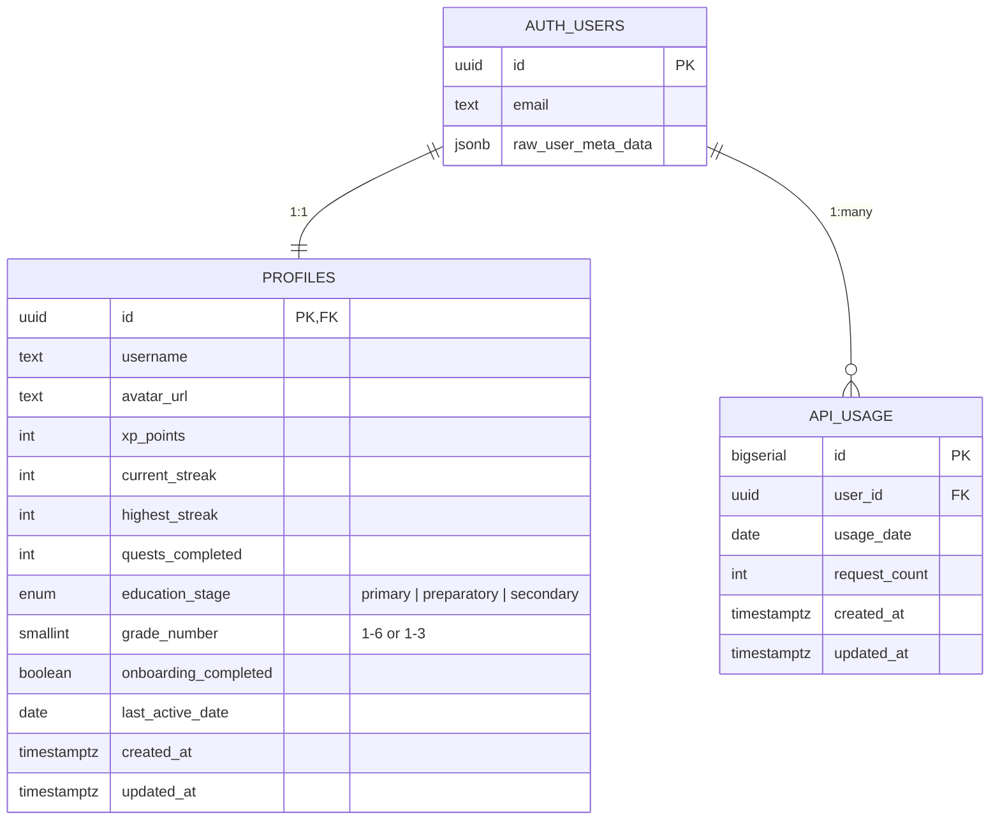
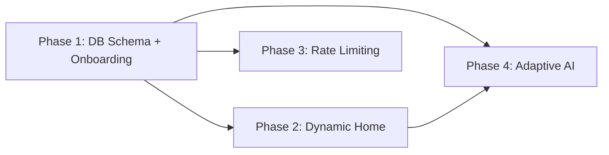

# LevelUp V2.0 — Architecture & Implementation Plan

> **Goal:** Pivot LevelUp from an MVP/hackathon project to a production-ready SaaS platform tailored for the Egyptian educational system.
> **Date:** 2026-02-27

---

## 📊 Current State Analysis

### What We Have (V1)

| Layer | Detail |
|---|---|
| **Framework** | Next.js 14 (App Router), TypeScript |
| **Auth** | Supabase Email/Password (sign in / sign up) |
| **Database** | Supabase `profiles` table — `id`, `username`, `avatar_url`, `xp_points`, `current_streak`, `highest_streak`, `quests_completed` |
| **AI** | Gemini 2.5 Flash via `/api/chat` — vision (image upload) + chat with 3-tier level-adaptive system prompt |
| **Gamification** | 12-level map (`config/gameData.ts`), XP awarding via `/api/xp`, `getLevelFromXp()` + `calculateDailyStreak()` |
| **UI** | Home page, Dashboard, Leaderboard, Level Map, Quest (Chat), Login |
| **Speech** | TTS (browser SpeechSynthesis), STT hook (`useSpeechToText.ts`) |

### What's Missing for V2

| Feature | Gap |
|---|---|
| **Onboarding** | No educational stage/grade selection; no mandatory onboarding step after signup |
| **Grade-Aware Content** | Level map and AI tutor are identical for all students regardless of grade |
| **Rate Limiting** | Zero protection on `/api/chat` — any user can make unlimited Gemini API calls |
| **Hyper-Adaptive AI** | System prompt adapts to gamification level only, not to educational stage |

---

## 🏗️ V2.0 — Four Implementation Phases

---

### Phase 1: Database Schema Evolution & Onboarding Flow

**Priority:** 🔴 Critical (foundation for all other phases)
**Estimated Effort:** 2-3 days

#### 1.1 — Database Migrations

Two new SQL migration files in `supabase/migrations/`:

##### Migration `002_add_education_fields.sql`

Adds educational stage and grade to the `profiles` table, plus an `onboarding_completed` flag to gate access.

```sql
-- 002_add_education_fields.sql
-- Adds Egyptian educational system fields to the profiles table.

-- Educational stage enum
CREATE TYPE public.education_stage AS ENUM (
  'primary',      -- ابتدائي (Grades 1-6)
  'preparatory',  -- إعدادي (Grades 1-3)
  'secondary'     -- ثانوي  (Grades 1-3)
);

-- Add columns to profiles
ALTER TABLE public.profiles
  ADD COLUMN IF NOT EXISTS education_stage public.education_stage,
  ADD COLUMN IF NOT EXISTS grade_number    SMALLINT,
  ADD COLUMN IF NOT EXISTS onboarding_completed BOOLEAN NOT NULL DEFAULT false,
  ADD COLUMN IF NOT EXISTS last_active_date DATE;

-- Validate grade ranges per stage
ALTER TABLE public.profiles
  ADD CONSTRAINT valid_grade_range CHECK (
    (education_stage = 'primary'     AND grade_number BETWEEN 1 AND 6) OR
    (education_stage = 'preparatory' AND grade_number BETWEEN 1 AND 3) OR
    (education_stage = 'secondary'   AND grade_number BETWEEN 1 AND 3) OR
    (education_stage IS NULL AND grade_number IS NULL)  -- allow NULLs during pre-onboarding
  );

-- Index for filtering/leaderboard by stage
CREATE INDEX IF NOT EXISTS idx_profiles_education
  ON public.profiles (education_stage, grade_number);
```

> [!NOTE]
> The `last_active_date` column may already exist as a `TIMESTAMPTZ` from V1. If using the column defined in V1's profile updates (`last_active_date` stored as ISO string), this migration should instead be:
> `ALTER TABLE public.profiles ALTER COLUMN last_active_date TYPE DATE USING last_active_date::DATE;`
> Verify your current Supabase schema before running.

##### Migration `003_add_rate_limiting.sql`

Creates a dedicated table to track API usage per user per day.

```sql
-- 003_add_rate_limiting.sql
-- Rate-limiting table for API usage tracking.

CREATE TABLE IF NOT EXISTS public.api_usage (
  id          BIGSERIAL PRIMARY KEY,
  user_id     UUID NOT NULL REFERENCES auth.users(id) ON DELETE CASCADE,
  usage_date  DATE NOT NULL DEFAULT CURRENT_DATE,
  request_count INTEGER NOT NULL DEFAULT 1,
  created_at  TIMESTAMPTZ NOT NULL DEFAULT NOW(),
  updated_at  TIMESTAMPTZ NOT NULL DEFAULT NOW(),

  UNIQUE (user_id, usage_date)
);

-- Enable RLS
ALTER TABLE public.api_usage ENABLE ROW LEVEL SECURITY;

-- Users can only read their own usage
CREATE POLICY "Users can view own usage"
  ON public.api_usage FOR SELECT
  USING (auth.uid() = user_id);

-- Only server (service_role) should INSERT/UPDATE — 
-- use a Supabase service client in the API route.
-- But we also allow the authenticated user for flexibility:
CREATE POLICY "Users can upsert own usage"
  ON public.api_usage FOR INSERT
  WITH CHECK (auth.uid() = user_id);

CREATE POLICY "Users can update own usage"
  ON public.api_usage FOR UPDATE
  USING (auth.uid() = user_id)
  WITH CHECK (auth.uid() = user_id);

-- Index for fast lookups
CREATE INDEX IF NOT EXISTS idx_api_usage_user_date
  ON public.api_usage (user_id, usage_date);

-- Optional: auto-cleanup old records (keep 90 days)
-- CREATE EXTENSION IF NOT EXISTS pg_cron;
-- SELECT cron.schedule('cleanup-api-usage', '0 3 * * *', 
--   $$DELETE FROM public.api_usage WHERE usage_date < CURRENT_DATE - INTERVAL '90 days'$$);
```

##### Updated TypeScript Types (`lib/supabase/types.ts`)

```typescript
export type EducationStage = 'primary' | 'preparatory' | 'secondary';

export interface Profile {
  id: string;
  username: string | null;
  avatar_url: string | null;
  xp_points: number;
  current_streak: number;
  highest_streak: number;
  quests_completed: number;
  education_stage: EducationStage | null;
  grade_number: number | null;
  onboarding_completed: boolean;
  last_active_date: string | null;
  created_at: string;
  updated_at: string;
}

export interface ApiUsage {
  id: number;
  user_id: string;
  usage_date: string;
  request_count: number;
}
```

#### 1.2 — Onboarding UI

##### New File: `app/onboarding/page.tsx`

A mandatory post-signup page where the user selects their educational stage and grade.

**UX Flow:**
1. User signs up → Supabase trigger creates profile with `onboarding_completed = false`.
2. After signup success, redirect to `/onboarding` instead of `/dashboard`.
3. Onboarding page shows a two-step selector:
   - **Step 1:** Select Educational Stage (3 cards: Primary ابتدائي, Preparatory إعدادي, Secondary ثانوي).
   - **Step 2:** Select Grade Number (dynamic: 1-6 for Primary, 1-3 for Preparatory/Secondary).
4. On submit → `PATCH /profiles` with `{ education_stage, grade_number, onboarding_completed: true }`.
5. Redirect to `/` (home/dashboard).

##### Modified File: `app/login/page.tsx`

- On signup success: redirect to `/onboarding` instead of showing "Check your email".
- On signin: after successful sign in, check `profile.onboarding_completed`. If `false`, redirect to `/onboarding`.

##### New Middleware: `middleware.ts` (project root)

```
Route guarding logic:
- If user is authenticated AND onboarding_completed = false → redirect to /onboarding
- If user is NOT authenticated AND trying to access /dashboard, /quest, etc. → redirect to /login
- Allow: /, /login, /onboarding (public or semi-public)
```

#### 1.3 — Egyptian Education Stage Constants

##### New File: `config/educationData.ts`

```typescript
export const EDUCATION_STAGES = [
  {
    id: 'primary' as const,
    nameEn: 'Primary Stage',
    nameAr: 'ابتدائي',
    grades: [1, 2, 3, 4, 5, 6],
    emoji: '🌱',
    description: 'Foundation years — ages 6-12',
  },
  {
    id: 'preparatory' as const,
    nameEn: 'Preparatory Stage',
    nameAr: 'إعدادي',
    grades: [1, 2, 3],
    emoji: '📚',
    description: 'Middle school — ages 12-15',
  },
  {
    id: 'secondary' as const,
    nameEn: 'Secondary Stage',
    nameAr: 'ثانوي',
    grades: [1, 2, 3],
    emoji: '🎓',
    description: 'High school — ages 15-18',
  },
] as const;
```

---

### Phase 2: Dynamic Home Page (Dashboard Redesign)

**Priority:** 🟡 High
**Estimated Effort:** 1-2 days

#### 2.1 — Personalized Home Page (`app/page.tsx`)

Redesign the home page to be the user's **primary dashboard**:

| Section | Data Source |
|---|---|
| **Welcome Header** | `profile.username`, `profile.education_stage`, `profile.grade_number` → "مرحباً يا أحمد! 🌱 ابتدائي — الصف الرابع" |
| **XP & Level Ring** | `profile.xp_points` → `getLevelFromXp()` → circular progress ring |
| **Daily Streak** | `profile.current_streak` → flame icon with streak count |
| **Energy Bar** | `api_usage.request_count` / `MAX_DAILY_REQUESTS` → "35/50 energy remaining" |
| **12-Level Map** | `config/gameData.ts` → but now **contextualized** to the user's stage |
| **Continue Quest CTA** | Link to `/quest` |

#### 2.2 — Stage-Aware Level Map (`config/gameData.ts`)

Transform the static `LEVELS` array into a **function** that returns stage-appropriate titles:

```typescript
// Example: getLevelsForStage('primary', 3) returns:
// Level 1: "مرحباً بالعالم!" (Hello World!)
// Level 7: "تحدي الرياضيات" (Math Challenge)
//
// getLevelsForStage('secondary', 3) returns:
// Level 1: "مقدمة في المنهج" (Curriculum Introduction)
// Level 7: "تحليل متقدم" (Advanced Analysis)
```

The map titles, descriptions, and XP rewards can scale by stage.

#### 2.3 — Merge Dashboard into Home

Currently there are two competing pages:
- `app/page.tsx` — home (shows streak, XP, quests)
- `app/dashboard/page.tsx` — dashboard (shows level ring, achievements, stats)

**Decision:** Merge them into a single rich home page at `/`. The `/dashboard` route can redirect to `/` or become a more detailed stats/achievements view.

---

### Phase 3: API Rate Limiting

**Priority:** 🔴 Critical (cost protection)
**Estimated Effort:** 1-2 days

#### 3.1 — Rate Limiter Middleware

##### Approach: Supabase-Native (No Upstash Required)

Since we already have Supabase, we use the `api_usage` table from Migration 003 to track daily request counts. This avoids adding a new dependency (Upstash Redis) while keeping the architecture simple.

##### New File: `lib/rateLimit.ts`

```typescript
// Core logic:
const MAX_DAILY_REQUESTS = 50;

async function checkRateLimit(supabase, userId: string) {
  const today = new Date().toISOString().split('T')[0]; // YYYY-MM-DD
  
  // UPSERT: increment counter or create new row
  const { data, error } = await supabase
    .from('api_usage')
    .upsert(
      { user_id: userId, usage_date: today, request_count: 1 },
      { onConflict: 'user_id,usage_date' }
    )
    .select('request_count')
    .single();
  
  // If row exists, increment instead
  // (Use RPC or raw SQL for atomic increment)
  
  return {
    allowed: data.request_count <= MAX_DAILY_REQUESTS,
    remaining: MAX_DAILY_REQUESTS - data.request_count,
    limit: MAX_DAILY_REQUESTS,
    resetAt: 'midnight UTC',
  };
}
```

> [!IMPORTANT]
> For **atomic increments**, we should create a small Supabase RPC function to avoid race conditions:
>
> ```sql
> -- Add to migration 003 or as a separate migration:
> CREATE OR REPLACE FUNCTION public.increment_api_usage(p_user_id UUID)
> RETURNS TABLE(request_count INTEGER, allowed BOOLEAN) AS $$
> DECLARE
>   v_count INTEGER;
>   v_max INTEGER := 50;
> BEGIN
>   INSERT INTO public.api_usage (user_id, usage_date, request_count)
>   VALUES (p_user_id, CURRENT_DATE, 1)
>   ON CONFLICT (user_id, usage_date)
>   DO UPDATE SET request_count = api_usage.request_count + 1,
>                 updated_at = NOW()
>   RETURNING api_usage.request_count INTO v_count;
>
>   RETURN QUERY SELECT v_count, (v_count <= v_max);
> END;
> $$ LANGUAGE plpgsql SECURITY DEFINER;
> ```

##### Modified File: `app/api/chat/route.ts`

Add rate limit check at the top of the `POST` handler:

```
1. Authenticate user
2. Call checkRateLimit(supabase, user.id)
3. If NOT allowed → return 429 with { error, remaining: 0, resetAt }
4. Otherwise → proceed to Gemini API call
5. Return rate limit headers: X-RateLimit-Remaining, X-RateLimit-Limit
```

#### 3.2 — "Out of Energy" UX

##### New Component: `components/OutOfEnergyModal.tsx`

When the chat API returns a `429` status:

- Show a full-screen modal with a drained battery/energy icon.
- Message in Arabic & English: "لقد نفدت طاقتك اليوم! 🔋 عد غداً لمواصلة رحلتك" / "You're out of energy today! Come back tomorrow."
- Two CTAs:
  - **Primary:** "OK" (dismiss)
  - **Secondary (Future):** "Use Premium XP ⚡" (placeholder for monetization)
- Show remaining time until reset (midnight UTC).

##### Energy Bar in Home Page

- Display an energy/battery bar: `{remaining}/{limit} requests today`.
- Color transitions: green (>30), yellow (10-30), red (<10).

#### 3.3 — Alternative: Upstash Redis (Future Scale)

If Supabase query latency becomes a bottleneck at scale:
- Install `@upstash/ratelimit` and `@upstash/redis`.
- Replace the Supabase-based limiter with an in-memory Redis sliding window.
- This is a **drop-in replacement** — the interface (`checkRateLimit`) stays the same.

---

### Phase 4: Hyper-Adaptive AI Tutor (System Prompt Matrix)

**Priority:** 🟡 High
**Estimated Effort:** 1-2 days

#### 4.1 — Two-Dimensional Adaptation Matrix

The AI system prompt now adapts across **two independent axes**:

| Axis | Current State | V2 State |
|---|---|---|
| **Gamification Level** (1-12) | ✅ 3 tiers (Beginner/Intermediate/Advanced) | ✅ Keep as-is |
| **Educational Stage** | ❌ Not implemented | 🆕 3 stages × grade-specific vocabulary |

This creates a **matrix** of personas:

```
                 Levels 1-3        Levels 4-6        Levels 7-12
                 (Guide)           (Tutor)           (Challenger)
Primary 1-3      Very simple       Simple with        Encouraging but
                 Arabic, emojis,   structure,         firm challenges,
                 stories, games    visual aids         age-appropriate

Primary 4-6      Simple Arabic,    Structured          More complex
                 relatable         curriculum-         challenges with
                 examples          aligned             real-world problems

Preparatory      Standard Arabic,  Academic but        Push for deeper
1-3              curriculum terms  approachable        understanding

Secondary        Professional      Full academic       University-prep
1-3              terminology       rigor               difficulty, debate
```

#### 4.2 — Refactored System Prompt Generator

##### Modified File: `app/api/chat/route.ts` → `getSystemInstruction()`

The function signature changes from:

```typescript
// V1
function getSystemInstruction(level: number, username: string): string

// V2
function getSystemInstruction(
  level: number,
  username: string,
  educationStage: EducationStage | null,
  gradeNumber: number | null
): string
```

**New prompt structure:**

```typescript
function getSystemInstruction(level, username, stage, grade) {
  // 1. Determine GAMIFICATION PERSONA (unchanged from V1)
  const gamificationPersona = getGamificationPersona(level);
  
  // 2. Determine EDUCATIONAL CONTEXT (new)
  const educationalContext = getEducationalContext(stage, grade);
  
  // 3. Compose the full system instruction
  return `
You are LevelUp Bot — a hyper-adaptive AI tutor for Egyptian students.

## Student Profile
- **Name:** ${username}
- **Educational Stage:** ${educationalContext.stageLabel} — Grade ${grade}
- **Gamification Level:** ${level}/12 (${gamificationPersona.label})

## Language & Tone Rules
${educationalContext.languageRules}

## Teaching Behavior
${gamificationPersona.behavior}

## Core Rules
- ALWAYS respond in Arabic unless the student asks in English.
- Adapt vocabulary complexity to the student's grade level.
- If an image is uploaded, analyze it step-by-step at the appropriate difficulty.
- Never give direct answers — guide the student to discover the answer.
- Use emojis and encouragement for younger students (Primary).
- Use academic precision for older students (Secondary).
`;
}
```

##### New File: `lib/aiPersona.ts`

Centralizes all persona logic:

```typescript
export function getGamificationPersona(level: number) {
  if (level <= 3) return {
    label: 'Friendly Guide 🌟',
    behavior: 'Be patient and encouraging. Use hints, not answers. Celebrate small wins.',
  };
  if (level <= 6) return {
    label: 'Balanced Tutor 📖',
    behavior: 'Mix support with challenge. Ask conceptual questions. Introduce terminology.',
  };
  return {
    label: 'The Challenger 🔥',
    behavior: 'Push hard. Ask "why" and "how". Don\'t accept surface answers. Debate-style.',
  };
}

export function getEducationalContext(stage, grade) {
  // Returns stage-specific language rules, vocabulary constraints, 
  // and example complexity levels.
  // Primary 1-3: "Use MSA simplified for children. Max sentence length: 10 words. Always use emojis."
  // Secondary 3: "Use full academic Arabic. Reference MOE curriculum standards. Prepare for Thanaweya Amma."
}
```

#### 4.3 — Fetching Education Data in Chat Route

The existing `/api/chat/route.ts` already fetches the profile to get `xp_points` and `username`. Simply add `education_stage` and `grade_number` to the SELECT:

```typescript
const { data: profile } = await supabase
  .from("profiles")
  .select("xp_points, username, education_stage, grade_number")
  .eq("id", user.id)
  .single();
```

Then pass them to `getSystemInstruction()`.

---

## 📁 Updated Folder Structure (V2)

```
f:\lvlup\
├── app/
│   ├── api/
│   │   ├── chat/route.ts           (MODIFY — add rate limiting + stage-aware prompt)
│   │   └── xp/route.ts             (existing)
│   ├── dashboard/page.tsx          (MODIFY — redirect to / or become stats-only)
│   ├── leaderboard/page.tsx        (existing)
│   ├── levels/page.tsx             (MODIFY — stage-aware map titles)
│   ├── login/page.tsx              (MODIFY — redirect logic for onboarding)
│   ├── onboarding/page.tsx         (NEW — stage/grade selection)
│   ├── quest/page.tsx              (MODIFY — handle 429 rate limit errors)
│   ├── globals.css
│   ├── layout.tsx
│   └── page.tsx                    (MODIFY — dynamic dashboard with energy bar)
├── components/
│   ├── ui/
│   ├── BottomNav.tsx
│   └── OutOfEnergyModal.tsx        (NEW — rate limit UX)
├── config/
│   ├── educationData.ts            (NEW — Egyptian education constants)
│   └── gameData.ts                 (MODIFY — stage-aware level titles)
├── hooks/
│   └── useSpeechToText.ts
├── lib/
│   ├── supabase/
│   │   ├── client.ts
│   │   ├── server.ts
│   │   └── types.ts                (MODIFY — add EducationStage, ApiUsage)
│   ├── aiPersona.ts                (NEW — gamification + education persona logic)
│   ├── gamification.ts
│   ├── rateLimit.ts                (NEW — rate limiter utility)
│   └── utils.ts
├── supabase/
│   └── migrations/
│       ├── 001_profiles.sql        (existing)
│       ├── 002_add_education_fields.sql  (NEW)
│       └── 003_add_rate_limiting.sql     (NEW)
├── middleware.ts                    (NEW — route guards for onboarding)
└── ...config files
```

---

## 📐 Entity Relationship Diagram



---

## 🔄 Dependency Order



Phase 1 is the **hard dependency** — everything else reads from the new `education_stage` / `grade_number` fields. Phases 2, 3, and 4 can be developed in parallel after Phase 1 is complete.

---

## ✅ Verification Plan

### After Phase 1 (Schema + Onboarding):
- Run migrations in Supabase SQL Editor → verify new columns appear in `profiles` table.
- Sign up a new user → verify redirect to `/onboarding`.
- Complete onboarding → verify `education_stage`, `grade_number`, and `onboarding_completed` are set in Supabase.
- Sign in as existing user with `onboarding_completed = false` → verify redirect to `/onboarding`.

### After Phase 2 (Dynamic Home):
- Log in as a Primary Grade 3 user → verify home page shows the correct stage label and personalized level map.
- Log in as a Secondary Grade 2 user → verify different map titles and language.
- Verify XP, streak, and energy bar update correctly.

### After Phase 3 (Rate Limiting):
- Send 50 requests via `/api/chat` → verify 51st returns HTTP 429.
- Verify `X-RateLimit-Remaining` header decrements.
- Verify "Out of Energy" modal appears in the UI.
- Wait for day rollover (or manually change `usage_date`) → verify counter resets.

### After Phase 4 (Adaptive AI):
- Chat as Primary Grade 1 (Level 1) → verify response uses very simple Arabic with emojis.
- Chat as Secondary Grade 3 (Level 10) → verify response uses academic Arabic and challenges the student.
- Chat as Preparatory Grade 2 (Level 5) → verify balanced, intermediate response.
