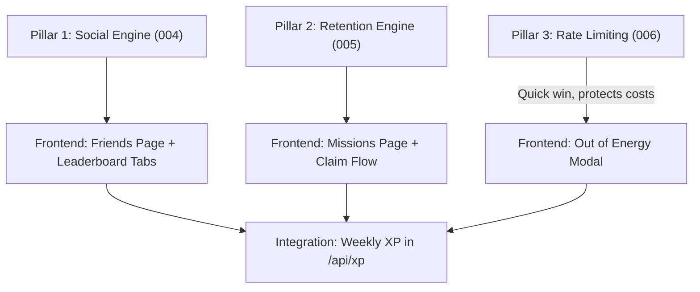

# LevelUp V3.0 — "The Social, Retention & Business Update"

> **Goal:** Evolve LevelUp from a solo-learner experience into a social, habit-forming SaaS platform with sustainable unit economics.
> **Date:** 2026-02-27

---

## 📊 V2 → V3 Gap Analysis

| Capability | V2 Status | V3 Target |
|---|---|---|
| **Social Graph** | ❌ None — leaderboard is global, anonymous | ✅ Friend requests, friend list, friends-only feed & leaderboard |
| **Retention Loops** | 🟡 Daily streak only | ✅ 3 daily quests/missions, bonus XP/Coins, mission variety |
| **Cost Protection** | ❌ No rate limiting — unlimited Gemini calls | ✅ 50 req/day per user, "Out of Energy" UX, atomic counter |
| **Weekly Competition** | ❌ All-time XP only | ✅ Weekly XP tracking, automated Sunday resets |
| **Virtual Currency** | ❌ XP only | ✅ Coins/Gems as secondary currency earned from missions |

---

## 🏗️ V3.0 — Three Implementation Pillars

---

### Pillar 1: The Social Engine (Friends & Competition)

**Priority:** 🟡 High
**Estimated Effort:** 3-4 days

#### 1.1 — Data Model

The social graph uses a **single `friendships` table** with a status enum. This avoids a separate `friend_requests` table and simplifies queries.

**Design rationale:** A friendship is a directional relationship initiated by `requester_id` towards `addressee_id`. When `status = 'accepted'`, both parties are friends. This model supports pending, accepted, declined, and blocked states in one table.

##### Migration `004_social_engine.sql`

```sql
-- ============================================================
-- 004_social_engine.sql
-- LevelUp V3: Social Engine — Friendships & Weekly XP
-- ============================================================

-- ┌──────────────────────────────────────────────────────────┐
-- │ 1. FRIENDSHIP STATUS ENUM                                │
-- └──────────────────────────────────────────────────────────┘

CREATE TYPE public.friendship_status AS ENUM (
  'pending',    -- Request sent, awaiting response
  'accepted',   -- Both users are friends
  'declined',   -- Request was declined (can be re-sent)
  'blocked'     -- One user blocked the other
);

-- ┌──────────────────────────────────────────────────────────┐
-- │ 2. FRIENDSHIPS TABLE                                     │
-- └──────────────────────────────────────────────────────────┘

CREATE TABLE IF NOT EXISTS public.friendships (
  id            BIGSERIAL PRIMARY KEY,
  requester_id  UUID NOT NULL REFERENCES auth.users(id) ON DELETE CASCADE,
  addressee_id  UUID NOT NULL REFERENCES auth.users(id) ON DELETE CASCADE,
  status        public.friendship_status NOT NULL DEFAULT 'pending',
  created_at    TIMESTAMPTZ NOT NULL DEFAULT NOW(),
  updated_at    TIMESTAMPTZ NOT NULL DEFAULT NOW(),

  -- Prevent duplicate requests in either direction
  CONSTRAINT unique_friendship_pair
    UNIQUE (requester_id, addressee_id),
  -- Cannot befriend yourself
  CONSTRAINT no_self_friendship
    CHECK (requester_id != addressee_id)
);

-- Indexes for fast lookups
CREATE INDEX idx_friendships_requester ON public.friendships (requester_id, status);
CREATE INDEX idx_friendships_addressee ON public.friendships (addressee_id, status);

-- ┌──────────────────────────────────────────────────────────┐
-- │ 3. WEEKLY XP TRACKING                                    │
-- └──────────────────────────────────────────────────────────┘
-- Tracks XP earned within a specific week for weekly leaderboards.
-- `week_start` is always a Monday (ISO 8601 week).

CREATE TABLE IF NOT EXISTS public.weekly_xp (
  id          BIGSERIAL PRIMARY KEY,
  user_id     UUID NOT NULL REFERENCES auth.users(id) ON DELETE CASCADE,
  week_start  DATE NOT NULL,  -- Monday of the ISO week
  xp_earned   INTEGER NOT NULL DEFAULT 0,
  created_at  TIMESTAMPTZ NOT NULL DEFAULT NOW(),
  updated_at  TIMESTAMPTZ NOT NULL DEFAULT NOW(),

  UNIQUE (user_id, week_start)
);

CREATE INDEX idx_weekly_xp_week ON public.weekly_xp (week_start, xp_earned DESC);

-- ┌──────────────────────────────────────────────────────────┐
-- │ 4. ROW LEVEL SECURITY — FRIENDSHIPS                      │
-- └──────────────────────────────────────────────────────────┘

ALTER TABLE public.friendships ENABLE ROW LEVEL SECURITY;

-- Users can see friendship rows they are part of
CREATE POLICY "Users can view own friendships"
  ON public.friendships FOR SELECT
  USING (auth.uid() = requester_id OR auth.uid() = addressee_id);

-- Users can send friend requests (insert as requester)
CREATE POLICY "Users can send friend requests"
  ON public.friendships FOR INSERT
  WITH CHECK (auth.uid() = requester_id);

-- Users can update friendships they are part of (accept/decline/block)
-- Requester can cancel; addressee can accept/decline/block
CREATE POLICY "Users can update own friendships"
  ON public.friendships FOR UPDATE
  USING (auth.uid() = requester_id OR auth.uid() = addressee_id)
  WITH CHECK (auth.uid() = requester_id OR auth.uid() = addressee_id);

-- Users can delete (unfriend) friendships they are part of
CREATE POLICY "Users can delete own friendships"
  ON public.friendships FOR DELETE
  USING (auth.uid() = requester_id OR auth.uid() = addressee_id);

-- ┌──────────────────────────────────────────────────────────┐
-- │ 5. ROW LEVEL SECURITY — WEEKLY XP                        │
-- └──────────────────────────────────────────────────────────┘

ALTER TABLE public.weekly_xp ENABLE ROW LEVEL SECURITY;

-- Everyone can read weekly XP (needed for leaderboard display)
CREATE POLICY "Weekly XP is viewable by everyone"
  ON public.weekly_xp FOR SELECT
  USING (true);

-- Only server-side (via service role or RPC) should write weekly XP
-- But allow user to upsert their own for flexibility
CREATE POLICY "Users can upsert own weekly XP"
  ON public.weekly_xp FOR INSERT
  WITH CHECK (auth.uid() = user_id);

CREATE POLICY "Users can update own weekly XP"
  ON public.weekly_xp FOR UPDATE
  USING (auth.uid() = user_id)
  WITH CHECK (auth.uid() = user_id);

-- ┌──────────────────────────────────────────────────────────┐
-- │ 6. HELPER: Increment weekly XP atomically                │
-- └──────────────────────────────────────────────────────────┘

CREATE OR REPLACE FUNCTION public.increment_weekly_xp(
  p_user_id UUID,
  p_xp_amount INTEGER
)
RETURNS void AS $$
BEGIN
  INSERT INTO public.weekly_xp (user_id, week_start, xp_earned)
  VALUES (
    p_user_id,
    date_trunc('week', CURRENT_DATE)::DATE,  -- Monday of current ISO week
    p_xp_amount
  )
  ON CONFLICT (user_id, week_start)
  DO UPDATE SET
    xp_earned = weekly_xp.xp_earned + p_xp_amount,
    updated_at = NOW();
END;
$$ LANGUAGE plpgsql SECURITY DEFINER;

-- ┌──────────────────────────────────────────────────────────┐
-- │ 7. HELPER: Get all accepted friend IDs for a user        │
-- └──────────────────────────────────────────────────────────┘

CREATE OR REPLACE FUNCTION public.get_friend_ids(p_user_id UUID)
RETURNS SETOF UUID AS $$
  SELECT CASE
    WHEN requester_id = p_user_id THEN addressee_id
    ELSE requester_id
  END
  FROM public.friendships
  WHERE status = 'accepted'
    AND (requester_id = p_user_id OR addressee_id = p_user_id);
$$ LANGUAGE sql STABLE SECURITY DEFINER;

-- Apply updated_at trigger
DROP TRIGGER IF EXISTS set_friendships_updated_at ON public.friendships;
CREATE TRIGGER set_friendships_updated_at
  BEFORE UPDATE ON public.friendships
  FOR EACH ROW EXECUTE FUNCTION public.set_updated_at();

DROP TRIGGER IF EXISTS set_weekly_xp_updated_at ON public.weekly_xp;
CREATE TRIGGER set_weekly_xp_updated_at
  BEFORE UPDATE ON public.weekly_xp
  FOR EACH ROW EXECUTE FUNCTION public.set_updated_at();
```

#### 1.2 — Key Queries

| Query | SQL Pattern |
|---|---|
| **Get pending requests** | `SELECT * FROM friendships WHERE addressee_id = :me AND status = 'pending'` |
| **Get friend list** | `SELECT * FROM get_friend_ids(:me)` → join with `profiles` |
| **Friends leaderboard (all-time)** | `SELECT * FROM profiles WHERE id IN (SELECT get_friend_ids(:me)) ORDER BY xp_points DESC` |
| **Friends leaderboard (weekly)** | `SELECT * FROM weekly_xp WHERE user_id IN (SELECT get_friend_ids(:me)) AND week_start = date_trunc('week', CURRENT_DATE) ORDER BY xp_earned DESC` |
| **Friend's progress** | `SELECT username, education_stage, grade_number, xp_points FROM profiles WHERE id IN (SELECT get_friend_ids(:me))` |

#### 1.3 — Frontend Pages (Future)

| Route | Purpose |
|---|---|
| `app/friends/page.tsx` | Friend list, pending requests, search |
| `app/leaderboard/page.tsx` | Add "Friends" / "Global" / "Weekly" tabs |
| `app/friends/[id]/page.tsx` | View a friend's public profile & progress |

---

### Pillar 2: The Retention Engine (Daily Missions & Rewards)

**Priority:** 🟡 High
**Estimated Effort:** 2-3 days

#### 2.1 — Design Philosophy

**Mission Templates** are predefined in a `daily_mission_templates` table. Each day, a server function (or Edge Function) assigns 3 random missions to each active user in `user_daily_missions`. Missions are tracked by progress counters and grant XP or Coins on completion.

**Virtual Currency:** We introduce **Coins (🪙)** as a secondary currency. XP measures progress; Coins measure engagement and can be spent on future premium features (avatar items, power-ups, etc.).

#### 2.2 — Adding Coins to Profiles

```sql
-- Part of migration 005
ALTER TABLE public.profiles
  ADD COLUMN IF NOT EXISTS coins INTEGER NOT NULL DEFAULT 0;
```

##### Migration `005_retention_engine.sql`

```sql
-- ============================================================
-- 005_retention_engine.sql
-- LevelUp V3: Retention Engine — Daily Missions & Rewards
-- ============================================================

-- ┌──────────────────────────────────────────────────────────┐
-- │ 1. ADD COINS TO PROFILES                                 │
-- └──────────────────────────────────────────────────────────┘

ALTER TABLE public.profiles
  ADD COLUMN IF NOT EXISTS coins INTEGER NOT NULL DEFAULT 0;

-- ┌──────────────────────────────────────────────────────────┐
-- │ 2. MISSION TEMPLATES — Predefined mission blueprints     │
-- └──────────────────────────────────────────────────────────┘

CREATE TYPE public.mission_type AS ENUM (
  'ask_questions',       -- "Ask N questions"
  'use_voice',           -- "Ask N questions using voice"
  'upload_image',        -- "Upload N images for analysis"
  'earn_xp',             -- "Earn N XP today"
  'reach_level',         -- "Reach Level N"
  'login_streak',        -- "Log in for N consecutive days"
  'complete_quests'      -- "Complete N quests"
);

CREATE TABLE IF NOT EXISTS public.daily_mission_templates (
  id              SERIAL PRIMARY KEY,
  mission_type    public.mission_type NOT NULL,
  title_ar        TEXT NOT NULL,          -- Arabic display title
  title_en        TEXT NOT NULL,          -- English display title
  description_ar  TEXT,
  description_en  TEXT,
  target_value    INTEGER NOT NULL,       -- e.g., 3 questions, 5 levels, 100 XP
  xp_reward       INTEGER NOT NULL DEFAULT 0,
  coin_reward     INTEGER NOT NULL DEFAULT 0,
  emoji           TEXT DEFAULT '⭐',
  difficulty      SMALLINT NOT NULL DEFAULT 1,  -- 1=easy, 2=medium, 3=hard
  is_active       BOOLEAN NOT NULL DEFAULT true
);

-- Seed initial mission templates
INSERT INTO public.daily_mission_templates 
  (mission_type, title_ar, title_en, target_value, xp_reward, coin_reward, emoji, difficulty)
VALUES
  ('ask_questions',    'اسأل ٣ أسئلة',            'Ask 3 Questions',              3,   30,  5,  '💬', 1),
  ('ask_questions',    'اسأل ٧ أسئلة',            'Ask 7 Questions',              7,   70,  10, '💬', 2),
  ('use_voice',        'استخدم الصوت ٣ مرات',       'Use Voice 3 Times',            3,   50,  8,  '🎤', 2),
  ('upload_image',     'ارفع صورة سؤال',           'Upload a Question Image',      1,   25,  5,  '📷', 1),
  ('upload_image',     'ارفع ٣ صور أسئلة',          'Upload 3 Question Images',     3,   75,  12, '📷', 2),
  ('earn_xp',          'اكسب ١٠٠ نقطة خبرة',       'Earn 100 XP',                  100, 50,  10, '⚡', 2),
  ('earn_xp',          'اكسب ٢٥٠ نقطة خبرة',       'Earn 250 XP',                  250, 100, 20, '⚡', 3),
  ('login_streak',     'سجّل دخول ٣ أيام متتالية',   'Login Streak: 3 Days',         3,   60,  15, '🔥', 2),
  ('login_streak',     'سجّل دخول ٧ أيام متتالية',   'Login Streak: 7 Days',         7,   150, 30, '🔥', 3),
  ('complete_quests',  'أكمل ٢ تحديات',            'Complete 2 Quests',            2,   40,  8,  '🏆', 1);

-- ┌──────────────────────────────────────────────────────────┐
-- │ 3. USER DAILY MISSIONS — Instance per user per day       │
-- └──────────────────────────────────────────────────────────┘

CREATE TABLE IF NOT EXISTS public.user_daily_missions (
  id              BIGSERIAL PRIMARY KEY,
  user_id         UUID NOT NULL REFERENCES auth.users(id) ON DELETE CASCADE,
  template_id     INTEGER NOT NULL REFERENCES public.daily_mission_templates(id),
  assigned_date   DATE NOT NULL DEFAULT CURRENT_DATE,
  current_value   INTEGER NOT NULL DEFAULT 0,   -- Progress tracker
  is_completed    BOOLEAN NOT NULL DEFAULT false,
  is_claimed      BOOLEAN NOT NULL DEFAULT false, -- Has the reward been claimed?
  completed_at    TIMESTAMPTZ,
  created_at      TIMESTAMPTZ NOT NULL DEFAULT NOW(),

  -- One instance per template per user per day
  UNIQUE (user_id, template_id, assigned_date)
);

CREATE INDEX idx_user_missions_user_date 
  ON public.user_daily_missions (user_id, assigned_date);

-- ┌──────────────────────────────────────────────────────────┐
-- │ 4. ROW LEVEL SECURITY — MISSIONS                         │
-- └──────────────────────────────────────────────────────────┘

-- Templates are public (read-only catalog)
ALTER TABLE public.daily_mission_templates ENABLE ROW LEVEL SECURITY;

CREATE POLICY "Mission templates are viewable by everyone"
  ON public.daily_mission_templates FOR SELECT
  USING (true);

-- User missions are private
ALTER TABLE public.user_daily_missions ENABLE ROW LEVEL SECURITY;

CREATE POLICY "Users can view own missions"
  ON public.user_daily_missions FOR SELECT
  USING (auth.uid() = user_id);

CREATE POLICY "Users can insert own missions"
  ON public.user_daily_missions FOR INSERT
  WITH CHECK (auth.uid() = user_id);

CREATE POLICY "Users can update own missions"
  ON public.user_daily_missions FOR UPDATE
  USING (auth.uid() = user_id)
  WITH CHECK (auth.uid() = user_id);

-- ┌──────────────────────────────────────────────────────────┐
-- │ 5. RPC: Assign 3 random daily missions to a user         │
-- └──────────────────────────────────────────────────────────┘

CREATE OR REPLACE FUNCTION public.assign_daily_missions(p_user_id UUID)
RETURNS SETOF public.user_daily_missions AS $$
DECLARE
  v_existing_count INTEGER;
BEGIN
  -- Check if today's missions are already assigned
  SELECT COUNT(*) INTO v_existing_count
  FROM public.user_daily_missions
  WHERE user_id = p_user_id AND assigned_date = CURRENT_DATE;

  IF v_existing_count >= 3 THEN
    -- Return existing missions
    RETURN QUERY
      SELECT * FROM public.user_daily_missions
      WHERE user_id = p_user_id AND assigned_date = CURRENT_DATE;
    RETURN;
  END IF;

  -- Assign 3 random active templates (mix of difficulties)
  INSERT INTO public.user_daily_missions (user_id, template_id, assigned_date)
  SELECT p_user_id, id, CURRENT_DATE
  FROM public.daily_mission_templates
  WHERE is_active = true
  ORDER BY RANDOM()
  LIMIT 3
  ON CONFLICT (user_id, template_id, assigned_date) DO NOTHING;

  RETURN QUERY
    SELECT * FROM public.user_daily_missions
    WHERE user_id = p_user_id AND assigned_date = CURRENT_DATE;
END;
$$ LANGUAGE plpgsql SECURITY DEFINER;

-- ┌──────────────────────────────────────────────────────────┐
-- │ 6. RPC: Claim mission reward                             │
-- └──────────────────────────────────────────────────────────┘

CREATE OR REPLACE FUNCTION public.claim_mission_reward(p_mission_id BIGINT)
RETURNS jsonb AS $$
DECLARE
  v_mission public.user_daily_missions;
  v_template public.daily_mission_templates;
BEGIN
  -- Get the mission
  SELECT * INTO v_mission
  FROM public.user_daily_missions
  WHERE id = p_mission_id AND user_id = auth.uid();

  IF NOT FOUND THEN
    RETURN jsonb_build_object('error', 'Mission not found');
  END IF;

  IF NOT v_mission.is_completed THEN
    RETURN jsonb_build_object('error', 'Mission not completed yet');
  END IF;

  IF v_mission.is_claimed THEN
    RETURN jsonb_build_object('error', 'Reward already claimed');
  END IF;

  -- Get template for rewards
  SELECT * INTO v_template
  FROM public.daily_mission_templates
  WHERE id = v_mission.template_id;

  -- Mark as claimed
  UPDATE public.user_daily_missions
  SET is_claimed = true
  WHERE id = p_mission_id;

  -- Award XP and Coins
  UPDATE public.profiles
  SET
    xp_points = xp_points + v_template.xp_reward,
    coins = coins + v_template.coin_reward,
    updated_at = NOW()
  WHERE id = auth.uid();

  RETURN jsonb_build_object(
    'success', true,
    'xp_awarded', v_template.xp_reward,
    'coins_awarded', v_template.coin_reward
  );
END;
$$ LANGUAGE plpgsql SECURITY DEFINER;
```

#### 2.3 — Mission Tracking Flow

```
User opens app
  └→ Client calls RPC: assign_daily_missions(user_id)
       └→ Returns 3 missions for today (or creates them)

User chats with AI
  └→ Server increments mission progress (ask_questions, use_voice, etc.)

Mission target reached
  └→ is_completed = true, completed_at = NOW()

User taps "Claim" button
  └→ Client calls RPC: claim_mission_reward(mission_id)
       └→ Awards XP + Coins atomically
```

#### 2.4 — Frontend Pages (Future)

| Route | Purpose |
|---|---|
| `app/missions/page.tsx` | Show today's 3 missions with progress bars |
| Component: `MissionCard.tsx` | Individual mission card with progress, emoji, claim button |
| Component: `CoinBadge.tsx` | Display coin balance in navbar/header |

---

### Pillar 3: The Business Engine (API Rate Limiting)

**Priority:** 🔴 Critical (cost protection)
**Estimated Effort:** 1-2 days

#### 3.1 — Data Model

##### Migration `006_api_rate_limiting.sql`

```sql
-- ============================================================
-- 006_api_rate_limiting.sql
-- LevelUp V3: Business Engine — API Rate Limiting
-- ============================================================

-- ┌──────────────────────────────────────────────────────────┐
-- │ 1. API USAGE TABLE                                       │
-- └──────────────────────────────────────────────────────────┘

CREATE TABLE IF NOT EXISTS public.api_usage (
  id              BIGSERIAL PRIMARY KEY,
  user_id         UUID NOT NULL REFERENCES auth.users(id) ON DELETE CASCADE,
  usage_date      DATE NOT NULL DEFAULT CURRENT_DATE,
  request_count   INTEGER NOT NULL DEFAULT 1,
  created_at      TIMESTAMPTZ NOT NULL DEFAULT NOW(),
  updated_at      TIMESTAMPTZ NOT NULL DEFAULT NOW(),

  UNIQUE (user_id, usage_date)
);

CREATE INDEX idx_api_usage_lookup ON public.api_usage (user_id, usage_date);

-- ┌──────────────────────────────────────────────────────────┐
-- │ 2. ROW LEVEL SECURITY                                    │
-- └──────────────────────────────────────────────────────────┘

ALTER TABLE public.api_usage ENABLE ROW LEVEL SECURITY;

CREATE POLICY "Users can view own usage"
  ON public.api_usage FOR SELECT
  USING (auth.uid() = user_id);

CREATE POLICY "Users can insert own usage"
  ON public.api_usage FOR INSERT
  WITH CHECK (auth.uid() = user_id);

CREATE POLICY "Users can update own usage"
  ON public.api_usage FOR UPDATE
  USING (auth.uid() = user_id)
  WITH CHECK (auth.uid() = user_id);

-- ┌──────────────────────────────────────────────────────────┐
-- │ 3. ATOMIC INCREMENT RPC                                  │
-- └──────────────────────────────────────────────────────────┘
-- Returns current count + whether the request is allowed.
-- This MUST be called BEFORE making the Gemini API call.

CREATE OR REPLACE FUNCTION public.increment_api_usage(p_user_id UUID)
RETURNS TABLE(current_count INTEGER, is_allowed BOOLEAN) AS $$
DECLARE
  v_count INTEGER;
  v_max_daily INTEGER := 50;  -- Configurable daily limit
BEGIN
  INSERT INTO public.api_usage (user_id, usage_date, request_count)
  VALUES (p_user_id, CURRENT_DATE, 1)
  ON CONFLICT (user_id, usage_date)
  DO UPDATE SET
    request_count = api_usage.request_count + 1,
    updated_at = NOW()
  RETURNING api_usage.request_count INTO v_count;

  RETURN QUERY SELECT v_count, (v_count <= v_max_daily);
END;
$$ LANGUAGE plpgsql SECURITY DEFINER;

-- ┌──────────────────────────────────────────────────────────┐
-- │ 4. HELPER: Get remaining requests for today              │
-- └──────────────────────────────────────────────────────────┘

CREATE OR REPLACE FUNCTION public.get_remaining_requests(p_user_id UUID)
RETURNS TABLE(used INTEGER, remaining INTEGER, daily_limit INTEGER) AS $$
DECLARE
  v_used INTEGER;
  v_limit INTEGER := 50;
BEGIN
  SELECT COALESCE(request_count, 0) INTO v_used
  FROM public.api_usage
  WHERE user_id = p_user_id AND usage_date = CURRENT_DATE;

  IF NOT FOUND THEN
    v_used := 0;
  END IF;

  RETURN QUERY SELECT v_used, GREATEST(v_limit - v_used, 0), v_limit;
END;
$$ LANGUAGE plpgsql SECURITY DEFINER;

-- Cleanup: optional auto-delete old records (> 90 days)
-- Uncomment if pg_cron is enabled in your Supabase project:
-- SELECT cron.schedule('cleanup-api-usage', '0 3 * * *',
--   $$DELETE FROM public.api_usage WHERE usage_date < CURRENT_DATE - INTERVAL '90 days'$$);

-- Apply updated_at trigger
DROP TRIGGER IF EXISTS set_api_usage_updated_at ON public.api_usage;
CREATE TRIGGER set_api_usage_updated_at
  BEFORE UPDATE ON public.api_usage
  FOR EACH ROW EXECUTE FUNCTION public.set_updated_at();
```

#### 3.2 — Integration into `/api/chat/route.ts`

```
POST /api/chat
  1. Authenticate user (existing)
  2. Call RPC: increment_api_usage(user.id)
  3. If is_allowed = false → return HTTP 429 + JSON { error, remaining: 0 }
  4. Proceed with Gemini API call (existing)
  5. Return response + headers: X-RateLimit-Remaining, X-RateLimit-Limit
```

#### 3.3 — "Out of Energy" UX (Frontend — Future)

| Component | Behavior |
|---|---|
| `OutOfEnergyModal.tsx` | Full-screen modal with 🔋 icon, Arabic message, countdown to midnight |
| Energy Bar (Home Page) | Shows `remaining/50` with green→yellow→red gradient |
| Quest Page Handler | On `429` response, trigger the modal instead of showing generic error |

---

## 📐 Complete Entity Relationship Diagram (V3)

```mermaid
erDiagram
    AUTH_USERS ||--|| PROFILES : "1:1"
    AUTH_USERS ||--o{ FRIENDSHIPS : "requester"
    AUTH_USERS ||--o{ FRIENDSHIPS : "addressee"
    AUTH_USERS ||--o{ WEEKLY_XP : "1:many"
    AUTH_USERS ||--o{ USER_DAILY_MISSIONS : "1:many"
    AUTH_USERS ||--o{ API_USAGE : "1:many"
    DAILY_MISSION_TEMPLATES ||--o{ USER_DAILY_MISSIONS : "1:many"

    PROFILES {
        uuid id PK_FK
        text username
        text avatar_url
        int xp_points
        int coins "NEW V3"
        int current_streak
        int highest_streak
        int quests_completed
        enum education_stage
        smallint grade_number
        bool onboarding_completed
        date last_active_date
    }

    FRIENDSHIPS {
        bigserial id PK
        uuid requester_id FK
        uuid addressee_id FK
        enum status "pending|accepted|declined|blocked"
        timestamptz created_at
    }

    WEEKLY_XP {
        bigserial id PK
        uuid user_id FK
        date week_start "Monday of ISO week"
        int xp_earned
    }

    DAILY_MISSION_TEMPLATES {
        serial id PK
        enum mission_type
        text title_ar
        text title_en
        int target_value
        int xp_reward
        int coin_reward
        smallint difficulty
        bool is_active
    }

    USER_DAILY_MISSIONS {
        bigserial id PK
        uuid user_id FK
        int template_id FK
        date assigned_date
        int current_value "progress counter"
        bool is_completed
        bool is_claimed
        timestamptz completed_at
    }

    API_USAGE {
        bigserial id PK
        uuid user_id FK
        date usage_date
        int request_count
    }
```

---

## 🔄 Implementation Order & Dependencies



> [!IMPORTANT]
> **Recommended order:** Pillar 3 (Rate Limiting) → Pillar 2 (Retention) → Pillar 1 (Social)
> 
> Rate limiting is a **business-critical** safeguard and should ship first. The Social Engine has the most frontend complexity and should be last.

---

## 📁 Migration File Summary

| File | Tables Created | Key RPC Functions |
|---|---|---|
| `004_social_engine.sql` | `friendships`, `weekly_xp` | `increment_weekly_xp()`, `get_friend_ids()` |
| `005_retention_engine.sql` | `daily_mission_templates`, `user_daily_missions` + `profiles.coins` | `assign_daily_missions()`, `claim_mission_reward()` |
| `006_api_rate_limiting.sql` | `api_usage` | `increment_api_usage()`, `get_remaining_requests()` |

---

## ✅ Post-Migration Verification Plan

### After Running Migration 004 (Social):
- Insert a friendship row manually → verify RLS: User A can see it, User C cannot.
- Call `get_friend_ids(user_a)` → verify it returns User B.
- Call `increment_weekly_xp(user_a, 100)` → verify `weekly_xp` row is created/incremented.

### After Running Migration 005 (Retention):
- Call `assign_daily_missions(user_a)` → verify 3 missions are created for today.
- Call again → verify it returns the same 3 (no duplicates).
- Manually set `is_completed = true` on one → call `claim_mission_reward(id)` → verify XP and Coins increment on profile.

### After Running Migration 006 (Rate Limiting):
- Call `increment_api_usage(user_a)` 50 times → verify 51st returns `is_allowed = false`.
- Call `get_remaining_requests(user_a)` → verify `remaining = 0`.
- Check that next calendar day resets the counter (new `usage_date`).
