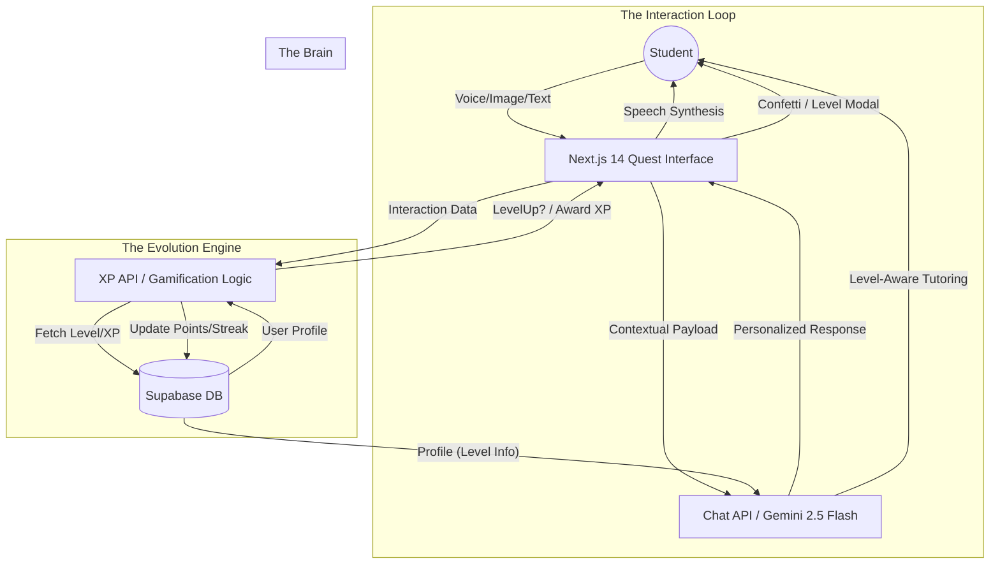

# LevelUp 🚀
### Transforming Boring Study Routines into Addictive, Gamified Journeys.

LevelUp is a 24/7 private AI tutor that leverages cutting-edge AI to provide an immersive, competitive, and highly personalized learning experience. Built for students who crave instant support and engaging educational paths.

---

## 🌟 The Vision
Traditional education is often static and unengaging. LevelUp turns every lesson into a "Quest," every answer into a "Combo," and every student into a "Hero." We bridge the gap between entertainment and education, making learning as addictive as a high-stakes RPG.

## 💡 Core Value Proposition
- **Adaptive Intelligence**: An AI tutor that grows with you. From a patient guide at Level 1 to a technical 'Challenger' at Level 10.
- **Multi-Modal Mastery**: It hears your voice via Web Speech API, sees your homework via Gemini Vision, and speaks back with real-time TTS.
- **The Gaming Engine**: A robust 12-level progression system powered by Supabase, featuring daily streaks, XP awarding, and real-time celebratory feedback.

---

## 🏗️ System Architecture

---

## 🛠️ Technical Stack
- **Framework**: [Next.js 14](https://nextjs.org/) (App Router, Server Components)
- **AI Brain**: [Google Gemini 2.5 Flash](https://ai.google.dev/) (Text, Vision, & Multi-modal logic)
- **Backend / Game Engine**: [Supabase](https://supabase.com/) (PostgreSQL, Auth, Edge Functions)
- **Voice Stack**: Native Web Speech API (Recognition + Synthesis)
- **UI/UX**: Tailwind CSS, Framer Motion, Lucide Icons, Canvas-Confetti

---

## 🚀 Getting Started

1. **Clone the repo**: `git clone https://github.com/your-repo/levelup`
2. **Setup Env**: Add `NEXT_PUBLIC_SUPABASE_URL`, `NEXT_PUBLIC_SUPABASE_ANON_KEY`, and `GOOGLE_GENERATIVE_AI_API_KEY`.
3. **Install**: `npm install`
4. **Play**: `npm run dev`

---
Copyright © 2026 LevelUp Team. All Rights Reserved.
